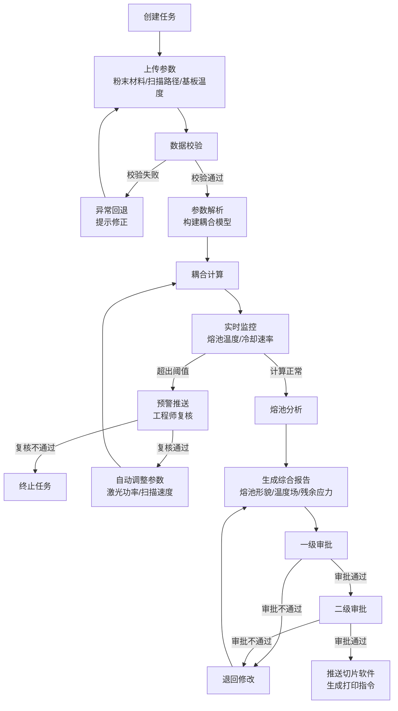
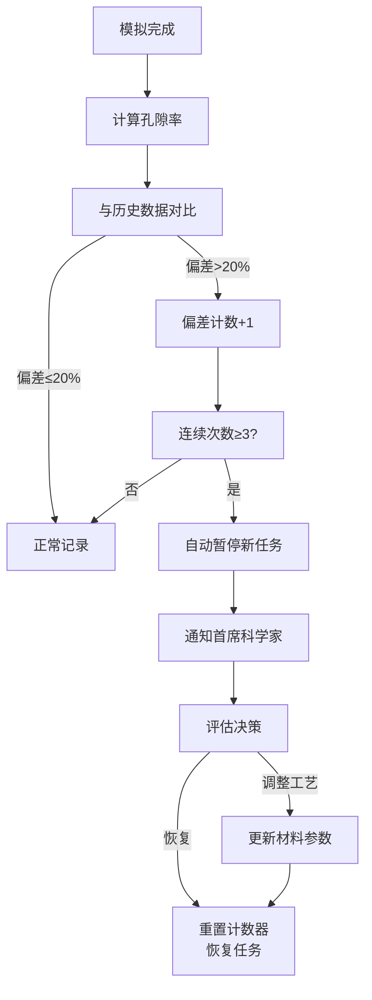

## 1. 产品概述

高精度粉末床熔融增材制造熔池动力学模拟与工艺优化平台，面向航空航天、医疗植入、汽车模具等高端制造领域的工程师与科研人员。通过热-流-固多物理场耦合仿真技术，实现激光粉末床熔融（LPBF）过程的熔池动力学精准模拟，为工艺参数优化提供数据驱动的决策支持。

- 核心价值：将物理仿真与智能推荐结合，大幅降低试错成本，提升打印成品率与零件性能
- 目标用户：工艺工程师、材料科学家、质量控制人员、首席科学家

## 2. 核心功能

### 2.1 用户角色

| 角色 | 注册方式 | 核心权限 |
|------|----------|----------|
| 工艺工程师 | 企业账号分配 | 创建模拟任务、上传参数、查看实时监控、提交复核申请 |
| 质量审核员 | 企业账号分配 | 两级审批、质量报告审核、孔隙率监控 |
| 首席科学家 | 企业账号分配 | 高级权限、材料库管理、异常决策、智能推荐调优 |
| 系统管理员 | 系统初始化 | 用户管理、系统配置、看板统计 |

### 2.2 功能模块

1. **任务中心**：模拟任务列表、状态流转、新建任务、任务详情
2. **参数配置**：粉末材料配置、激光扫描路径配置、基板温度参数
3. **实时监控**：熔池温度监控、冷却速率监控、安全阈值预警
4. **报告中心**：综合报告PDF、熔池形貌分析、温度场分布、残余应力分布
5. **智能推荐**：历史模拟数据、最优工艺参数推荐、参数敏感性分析
6. **审批流程**：两级审批机制、审批记录、退回重审
7. **质量监控**：孔隙率偏差分析、材料质量预警、暂停机制
8. **数据看板**：每日统计、完成率看板、趋势分析

### 2.3 页面详情

| 页面名称 | 模块名称 | 功能描述 |
|-----------|----------|----------|
| 控制台首页 | 数据看板 | 模拟完成率统计、今日任务概览、异常告警、快捷入口 |
| 任务中心 | 任务列表 | 任务卡片展示、状态筛选、搜索、分页、新建任务按钮 |
| 任务详情 | 状态时间线 | 待校验-参数解析-耦合计算-熔池分析-完成-异常回退状态流转可视化 |
| 任务详情 | 实时监控 | 熔池温度曲线图、冷却速率仪表盘、安全阈值指示、预警推送 |
| 新建任务 | 参数上传 | 粉末材料选择/上传、激光扫描路径文件上传、基板温度设置 |
| 新建任务 | 数据校验 | 数据完整性自动校验、错误提示、修正建议 |
| 报告查看 | 综合报告 | 熔池形貌3D视图、温度场云图、残余应力分布、PDF下载 |
| 智能推荐 | 推荐引擎 | 历史模拟数据列表、最优参数推荐、参数对比分析 |
| 审批中心 | 审批列表 | 待审批任务、审批操作、两级审批流转记录 |
| 质量监控 | 孔隙率分析 | 材料孔隙率趋势、偏差超阈值预警、暂停机制触发 |
| 材料库 | 材料管理 | 粉末材料属性管理、材料参数模板、热物理参数 |
| 系统设置 | 用户管理 | 角色权限管理、账号配置、操作日志 |

## 3. 核心流程

### 3.1 模拟任务主流程

用户创建模拟任务并上传粉末材料、激光扫描路径和基板温度参数后，系统自动校验数据完整性。校验通过后进入参数解析阶段，构建热-流-固耦合模型。耦合计算过程中实时监控熔池温度与冷却速率，超出安全阈值时触发预警并推送至工程师复核。复核通过则自动调整激光功率或扫描速度重新模拟。模拟完成后生成综合报告，经两级审批后推送至切片软件生成打印指令。

### 3.2 孔隙率监控流程

同一材料连续三次孔隙率偏差超20%时自动暂停新任务并通知首席科学家，待评估后决定是否恢复。

## 4. 用户界面设计

### 4.1 设计风格

- **主色调**：深空蓝 (#0A1628) 作为背景主色，体现工业科技感与专业精密
- **辅助色**：科技青 (#00D4FF) 用于高亮、数据可视化、交互元素
- **预警色**：熔橙 (#FF6B35) 用于高温预警、异常状态
- **成功色**：荧光绿 (#39FF14) 用于正常状态、完成标识
- **危险色**：警戒红 (#FF1744) 用于严重错误、暂停状态
- **字体**：标题使用 Space Grotesk 粗体，正文使用 Inter，数据数字使用 JetBrains Mono 等宽字体
- **布局风格**：深色工业仪表盘风格，卡片式模块化布局，左侧导航 + 主内容区
- **视觉元素**：网格背景、扫描线效果、数据光晕、金属质感边框
- **动效**：脉冲扫描动画、数据流式加载、状态切换过渡、温度渐变效果

### 4.2 页面设计概览

| 页面名称 | 模块名称 | UI 元素 |
|-----------|----------|---------|
| 控制台首页 | 数据看板 | 顶部统计卡片、状态环形图、实时监控折线图、最近任务列表 |
| 任务中心 | 任务列表 | 筛选标签栏、任务卡片网格、状态徽章、进度条 |
| 任务详情 | 状态时间线 | 垂直时间线、状态节点、当前状态高亮、流转记录 |
| 任务详情 | 实时监控 | 温度曲线图（面积图）、冷却速率仪表盘、阈值参考线、预警弹窗 |
| 新建任务 | 参数上传 | 分步表单、文件拖拽上传区、参数滑块、校验结果提示 |
| 报告查看 | 综合报告 | 标签页切换、3D熔池视图、温度云图、应力分布图、下载按钮 |
| 智能推荐 | 推荐引擎 | 参数对比表格、推荐卡、历史数据散点图、置信度指示 |
| 审批中心 | 审批列表 | 待办卡片、审批操作按钮、审批意见输入框、流转记录 |
| 质量监控 | 孔隙率分析 | 趋势折线图、偏差标记线、暂停状态横幅、通知记录 |

### 4.3 响应式

- 桌面端优先设计，针对大屏幕优化数据展示密度
- 平板端自适应调整卡片布局，保持主要功能可用
- 移动端简化视图，重点展示任务状态与告警信息

### 4.4 数据可视化规范

- 温度场使用蓝-青-黄-橙-红渐变色谱
- 所有数值显示保留合适精度，关键指标使用大号等宽字体
- 实时数据带有脉冲动画效果，模拟真实传感器读数
- 图表支持悬浮查看详细数值，支持区域缩放
