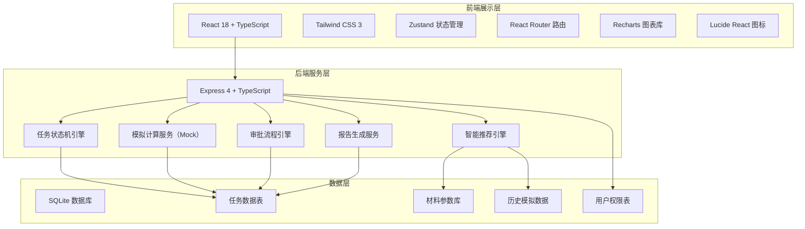
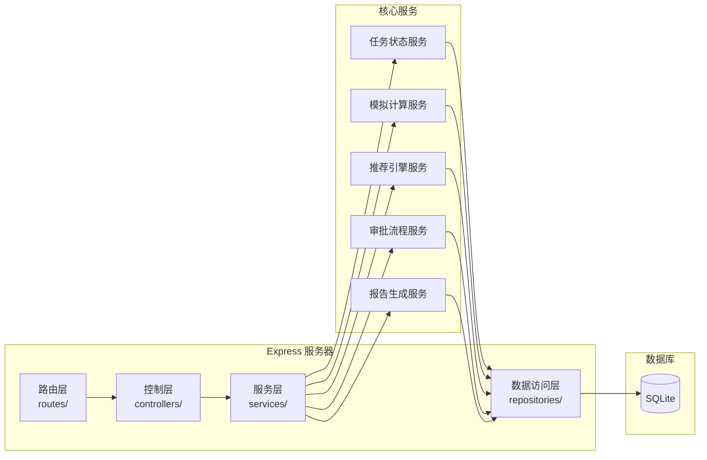
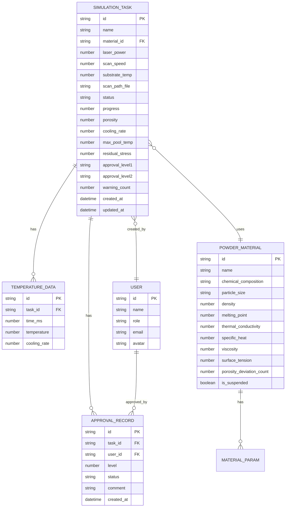

## 1. 架构设计



## 2. 技术描述

- **前端**：React@18 + TypeScript + Vite
- **样式方案**：Tailwind CSS@3
- **状态管理**：Zustand
- **路由**：React Router DOM@6
- **图表可视化**：Recharts
- **图标库**：Lucide React
- **初始化工具**：vite-init
- **后端**：Express@4 + TypeScript
- **数据库**：SQLite（开发环境）
- **数据格式**：Mock 数据模拟真实计算结果

## 3. 路由定义

| 路由 | 页面 | 用途 |
|------|------|------|
| /dashboard | 控制台首页 | 数据看板、今日概览、快捷入口 |
| /tasks | 任务中心 | 模拟任务列表、筛选、搜索 |
| /tasks/new | 新建任务 | 参数上传、数据校验 |
| /tasks/:id | 任务详情 | 状态时间线、实时监控 |
| /tasks/:id/report | 报告查看 | 综合报告、数据分析 |
| /recommend | 智能推荐 | 最优参数推荐、历史数据分析 |
| /approval | 审批中心 | 待审批列表、审批操作 |
| /quality | 质量监控 | 孔隙率分析、质量预警 |
| /materials | 材料库 | 粉末材料管理 |
| /settings | 系统设置 | 用户管理、系统配置 |

## 4. API 定义

### 4.1 类型定义

```typescript
// 任务状态枚举
type TaskStatus = 'pending_verify' | 'parsing' | 'computing' | 'analyzing' | 'completed' | 'failed' | 'rollback';

// 审批状态
type ApprovalStatus = 'pending' | 'approved' | 'rejected';

// 模拟任务
interface SimulationTask {
  id: string;
  name: string;
  materialId: string;
  materialName: string;
  laserPower: number;        // 激光功率 W
  scanSpeed: number;        // 扫描速度 mm/s
  substrateTemp: number;    // 基板温度 °C
  scanPathFile: string;     // 扫描路径文件名
  status: TaskStatus;
  progress: number;         // 0-100
  createdAt: string;
  updatedAt: string;
  porosity: number;         // 孔隙率 %
  coolingRate: number;      // 冷却速率 K/s
  maxPoolTemp: number;      // 最高熔池温度 K
  residualStress: number;   // 残余应力 MPa
  approvalLevel1: ApprovalStatus;
  approvalLevel2: ApprovalStatus;
  warningCount: number;     // 预警次数
}

// 粉末材料
interface PowderMaterial {
  id: string;
  name: string;
  chemicalComposition: string;
  particleSize: string;     // 粒径范围
  density: number;          // 密度 g/cm³
  meltingPoint: number;     // 熔点 K
  thermalConductivity: number; // 热导率 W/(m·K)
  specificHeat: number;     // 比热容 J/(kg·K)
  viscosity: number;        // 粘度 Pa·s
  surfaceTension: number;   // 表面张力 N/m
  porosityDeviationCount: number; // 连续孔隙率偏差次数
  isSuspended: boolean;     // 是否暂停
}

// 温度数据点
interface TemperatureData {
  time: number;             // 时间 ms
  temperature: number;      // 温度 K
  coolingRate: number;      // 冷却速率 K/s
}

// 推荐参数
interface RecommendedParams {
  laserPower: number;
  scanSpeed: number;
  substrateTemp: number;
  confidence: number;       // 置信度 0-1
  predictedPorosity: number;
  predictedStrength: number; // 预测强度 MPa
  similarCases: number;     // 相似案例数
}

// 用户
interface User {
  id: string;
  name: string;
  role: 'engineer' | 'reviewer' | 'scientist' | 'admin';
  email: string;
  avatar: string;
}
```

### 4.2 API 接口列表

| 方法 | 路径 | 描述 |
|------|------|------|
| GET | /api/tasks | 获取任务列表 |
| GET | /api/tasks/:id | 获取任务详情 |
| POST | /api/tasks | 创建新任务 |
| PUT | /api/tasks/:id | 更新任务参数 |
| POST | /api/tasks/:id/verify | 触发数据校验 |
| GET | /api/tasks/:id/temperature | 获取实时温度数据 |
| POST | /api/tasks/:id/review | 提交复核申请 |
| POST | /api/tasks/:id/restart | 重新开始模拟 |
| GET | /api/tasks/:id/report | 获取报告数据 |
| GET | /api/materials | 获取材料列表 |
| GET | /api/materials/:id | 获取材料详情 |
| POST | /api/materials | 新增材料 |
| PUT | /api/materials/:id | 更新材料 |
| GET | /api/recommend | 获取智能推荐参数 |
| GET | /api/approval/pending | 获取待审批列表 |
| POST | /api/approval/:taskId/approve | 审批通过 |
| POST | /api/approval/:taskId/reject | 审批驳回 |
| GET | /api/quality/porosity | 获取孔隙率统计数据 |
| POST | /api/quality/suspend | 暂停材料任务 |
| POST | /api/quality/resume | 恢复材料任务 |
| GET | /api/dashboard/stats | 获取仪表盘统计数据 |
| GET | /api/users | 获取用户列表 |

## 5. 服务器架构图



## 6. 数据模型

### 6.1 数据模型 ER 图



### 6.2 数据定义语言

```sql
-- 用户表
CREATE TABLE users (
  id TEXT PRIMARY KEY,
  name TEXT NOT NULL,
  role TEXT NOT NULL CHECK (role IN ('engineer', 'reviewer', 'scientist', 'admin')),
  email TEXT UNIQUE NOT NULL,
  avatar TEXT,
  created_at DATETIME DEFAULT CURRENT_TIMESTAMP
);

-- 粉末材料表
CREATE TABLE powder_materials (
  id TEXT PRIMARY KEY,
  name TEXT NOT NULL,
  chemical_composition TEXT,
  particle_size TEXT,
  density REAL,
  melting_point REAL,
  thermal_conductivity REAL,
  specific_heat REAL,
  viscosity REAL,
  surface_tension REAL,
  porosity_deviation_count INTEGER DEFAULT 0,
  is_suspended INTEGER DEFAULT 0,
  created_at DATETIME DEFAULT CURRENT_TIMESTAMP,
  updated_at DATETIME DEFAULT CURRENT_TIMESTAMP
);

-- 模拟任务表
CREATE TABLE simulation_tasks (
  id TEXT PRIMARY KEY,
  name TEXT NOT NULL,
  material_id TEXT REFERENCES powder_materials(id),
  material_name TEXT,
  laser_power REAL NOT NULL,
  scan_speed REAL NOT NULL,
  substrate_temp REAL NOT NULL,
  scan_path_file TEXT,
  status TEXT NOT NULL DEFAULT 'pending_verify'
    CHECK (status IN ('pending_verify', 'parsing', 'computing', 'analyzing', 'completed', 'failed', 'rollback')),
  progress INTEGER DEFAULT 0,
  porosity REAL,
  cooling_rate REAL,
  max_pool_temp REAL,
  residual_stress REAL,
  approval_level1 TEXT DEFAULT 'pending'
    CHECK (approval_level1 IN ('pending', 'approved', 'rejected')),
  approval_level2 TEXT DEFAULT 'pending'
    CHECK (approval_level2 IN ('pending', 'approved', 'rejected')),
  warning_count INTEGER DEFAULT 0,
  created_by TEXT REFERENCES users(id),
  created_at DATETIME DEFAULT CURRENT_TIMESTAMP,
  updated_at DATETIME DEFAULT CURRENT_TIMESTAMP
);

-- 温度数据表
CREATE TABLE temperature_data (
  id TEXT PRIMARY KEY,
  task_id TEXT REFERENCES simulation_tasks(id),
  time_ms REAL NOT NULL,
  temperature REAL NOT NULL,
  cooling_rate REAL NOT NULL,
  created_at DATETIME DEFAULT CURRENT_TIMESTAMP
);

-- 审批记录表
CREATE TABLE approval_records (
  id TEXT PRIMARY KEY,
  task_id TEXT REFERENCES simulation_tasks(id),
  user_id TEXT REFERENCES users(id),
  level INTEGER NOT NULL CHECK (level IN (1, 2)),
  status TEXT NOT NULL CHECK (status IN ('approved', 'rejected')),
  comment TEXT,
  created_at DATETIME DEFAULT CURRENT_TIMESTAMP
);

-- 索引
CREATE INDEX idx_tasks_status ON simulation_tasks(status);
CREATE INDEX idx_tasks_material ON simulation_tasks(material_id);
CREATE INDEX idx_temp_task ON temperature_data(task_id);
CREATE INDEX idx_approval_task ON approval_records(task_id);
```

### 6.3 初始数据

```sql
-- 初始用户
INSERT INTO users (id, name, role, email, avatar) VALUES
('u001', '张工', 'engineer', 'zhang.gong@example.com', 'ZG'),
('u002', '李审核', 'reviewer', 'li.shenhe@example.com', 'LS'),
('u003', '王首席', 'scientist', 'wang.shouxi@example.com', 'WS'),
('u004', '系统管理员', 'admin', 'admin@example.com', 'AD');

-- 初始材料
INSERT INTO powder_materials (id, name, chemical_composition, particle_size, density, melting_point, thermal_conductivity, specific_heat, viscosity, surface_tension) VALUES
('m001', 'Ti-6Al-4V', 'Ti-6Al-4V', '15-45 μm', 4.43, 1923, 7.5, 560, 0.0045, 1.55),
('m002', '316L不锈钢', 'Fe-17Cr-12Ni-2.5Mo', '15-53 μm', 7.98, 1700, 16.2, 500, 0.0062, 1.82),
('m003', 'AlSi10Mg', 'Al-10Si-0.5Mg', '20-63 μm', 2.68, 868, 155, 960, 0.0028, 0.87),
('m004', 'Inconel 718', 'Ni-19Cr-18Fe-5Nb-3Mo', '15-45 μm', 8.19, 1609, 11.2, 460, 0.0058, 1.95),
('m005', 'CoCrMo', 'Co-28Cr-6Mo', '15-45 μm', 8.35, 1653, 12.8, 420, 0.0065, 1.88);
```
